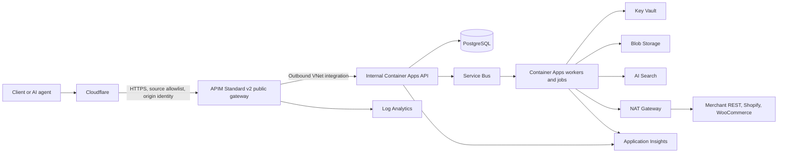

# Azure MVP deployment architecture

Status: **Accepted for MVP**

Decision date: **2026-07-16**

## Scope

This document records the current deployment decision for the EcommX AI platform. This repository
contains the merchant integration contract, documentation, and custom REST starters. It does not
contain the EcommX AI Gateway, dashboard, connector workers, or Azure infrastructure code.

The architecture below therefore defines the deployment target for those platform components. It
does not change the merchant-facing contract in
[`openapi/custom-rest.v1.yaml`](../../openapi/custom-rest.v1.yaml).

## Accepted MVP decisions

| Area | MVP decision |
| --- | --- |
| Azure region | Japan East |
| Disaster recovery | Deferred; no multi-region deployment or automated regional failover |
| Edge provider | Cloudflare |
| API gateway | Azure API Management Standard v2 |
| APIM ingress | Public gateway, restricted to authenticated Cloudflare-origin traffic |
| Application runtime | Internal Azure Container Apps environment |
| APIM to application | APIM outbound virtual network integration |
| Future edge portability | Cloudflare must be replaceable by Azure Front Door Premium |

Japan East supports API Management Standard v2. Japan West does not currently appear in the
official v2-tier availability list. This does not block the single-region MVP.

## Platform and merchant boundaries

- EcommX AI deploys the edge, API gateway, platform APIs, synchronization workers, and platform data
  services described here.
- Shopify and WooCommerce merchants connect credentials; they do not deploy merchant-side code.
- A custom REST merchant deploys the five required endpoints in its own environment and follows the
  OpenAPI contract exactly.
- Merchant-generated bearer credentials flow from the merchant to EcommX AI. Raw credentials must
  be retrievable by connector workers from Key Vault; business records and user interfaces store
  only non-secret metadata such as a fingerprint and last four characters.

## MVP topology



The minimum runtime is the APIM gateway and the Container Apps API. Service Bus, workers, Blob
Storage, AI Search, and PostgreSQL are the target platform services for asynchronous catalog
ingestion and search. Their exact MVP capacity depends on the platform implementation and measured
catalog volume.

## Network design

### Cloudflare to API Management

Cloudflare proxies the public platform hostname to the public APIM Standard v2 gateway.

The APIM gateway must enforce both source and edge identity:

1. Apply an APIM `ip-filter` policy containing the published Cloudflare origin IP ranges.
2. Require an origin identity that is controlled by the EcommX AI Cloudflare zone:
   - preferred: zone-level Authenticated Origin Pulls with a dedicated client certificate validated
     by APIM; or
   - fallback: a Cloudflare Request Header Transform Rule that overwrites a dedicated origin
     verification header, with APIM rejecting a missing or incorrect value.
3. Reject requests that do not satisfy both checks before authentication and quota policies run.
4. Automate Cloudflare IP-range updates. Add new ranges before removing old ranges.
5. Use end-to-end HTTPS and Cloudflare Full (strict) mode.

Cloudflare IP ranges are shared by all Cloudflare customers. Full (strict) verifies the APIM server
certificate but does not prove that a request came through the EcommX AI Cloudflare zone. Neither
control is sufficient on its own.

APIM `ip-filter` is a gateway policy, not a network-layer firewall. The public APIM endpoint remains
reachable before the policy rejects a request. This is an accepted, time-bounded MVP limitation.

### API Management to Container Apps

APIM Standard v2 uses outbound virtual network integration to reach an internal Container Apps
environment:

- APIM, its integration virtual network, and the delegated integration subnet must be in Japan East
  and in the same Azure subscription.
- The APIM integration subnet is dedicated to one APIM instance. The documented minimum size is
  `/27`; reserve `/24` to avoid constraining scale.
- The Container Apps environment uses a separate infrastructure subnet and internal ingress.
- Private DNS is linked so APIM can resolve the internal Container Apps hostname.
- The Container Apps API accepts only the intended APIM caller. Prefer APIM managed identity and
  Microsoft Entra token validation in addition to private network reachability.

Standard v2 does not provide deterministic public outbound IP addresses. This does not affect this
design because the APIM backend is private rather than a public ACA endpoint protected by an IP
allowlist.

### Connector egress

Connector workers call merchant-hosted custom REST APIs and the Shopify and WooCommerce APIs.

- Route connector internet egress through a NAT Gateway when merchants need a stable platform
  allowlist.
- Retrieve merchant credentials from Key Vault by managed identity.
- Never copy raw merchant credentials into PostgreSQL, logs, deployment output, or Terraform state.
- Preserve the custom REST rules for decimal-string money, SKU identity, inventory semantics, and
  opaque cursors when normalizing catalog data.

## Service responsibilities

| Service | Responsibility |
| --- | --- |
| Cloudflare | DNS, edge TLS, DDoS protection, WAF, coarse abuse controls, origin authentication |
| API Management | API authentication, authorization, quotas, versioning, routing, and transformations |
| Container Apps API | Dashboard and control-plane APIs |
| Container Apps workers/jobs | Shopify, WooCommerce, and custom REST synchronization |
| Service Bus | Asynchronous work, retries, and dead-letter handling |
| PostgreSQL | Control-plane and normalized catalog source of truth |
| Blob Storage | Raw catalog snapshots and replay/audit material |
| AI Search | Rebuildable search projection; never the source of truth |
| Key Vault | Merchant credentials, signing keys, and other secrets |
| NAT Gateway | Stable connector outbound IP addresses |
| Application Insights and Log Analytics | Traces, metrics, gateway logs, and alerts |

Checkout and payment-related data remain outside the basic catalog synchronization path. If
checkout is enabled, its reservation, idempotency, personally identifiable information, and payment
authorization boundaries require a separate production-readiness review.

## Cloudflare plan

The edge provider is decided; the Cloudflare plan is not.

- A non-public proof of concept can technically use Free because Transform Rules and Authenticated
  Origin Pulls are available on all plans.
- Before an internet-facing MVP launch, select Business or explicitly accept the residual limits in
  managed WAF controls, rule capacity, support, and edge log export.
- Enterprise is not an MVP requirement unless the launch requires complete Logpush, advanced
  per-tenant edge rate limiting, enterprise SaaS hostname features, or contract-specific support.

Business quotas belong in APIM. Cloudflare rate limiting is an edge abuse control and must not
become the system of record for subscription enforcement.

## Edge portability requirements

Cloudflare is the MVP edge, but it must not become an application dependency.

1. Keep authentication, authorization, quotas, API versions, routing, and request transformations
   in APIM.
2. Do not use Cloudflare Workers, KV, Access, or Cloudflare-only JWT features in the core request
   path.
3. Do not expose Cloudflare-specific headers to application code. APIM normalizes client IP,
   forwarding, and correlation headers into provider-neutral values.
4. Disable edge caching for APIs by default. Any cached endpoint must define provider-neutral TTL,
   cache-key, invalidation, and purge behavior.
5. Store custom-domain inventory, ownership validation status, and certificate lifecycle state in
   the platform control plane, not only in Cloudflare.
6. Separate infrastructure modules and state into:
   - shared Azure platform resources;
   - `edge-cloudflare`; and
   - future `edge-afd`.
7. Never pass Cloudflare resource identifiers or rule IDs into APIM policies or application
   configuration.

Reuse the BTPlatform Cloudflare module pattern, not its Cloudflare zone, credentials, Terraform
state, cache rules, or security policies.

## Future migration to Azure Front Door Premium

Azure officially supports Front Door Premium connecting to the API Management `Gateway`
subresource through Private Link. Japan East is an available Front Door Private Link region.

The target migration path is:

```text
Azure Front Door Premium
  -> Private Link (API Management Gateway)
  -> existing APIM Standard v2
  -> existing outbound VNet integration
  -> existing internal Container Apps environment
```

Migration does not require rebuilding APIM, Container Apps, connector workers, or platform data
services.

### Cutover sequence

1. Provision Front Door Premium, WAF policies, routes, certificates, and custom domains in the
   separate `edge-afd` module.
2. Add APIM as a Private Link origin with target subresource `Gateway`, and approve the private
   endpoint connection.
3. Keep APIM public access enabled temporarily so Cloudflare and Front Door can run in parallel.
4. Validate the OpenAPI contract, authentication, quotas, WAF behavior, health probes, client IP
   normalization, correlation IDs, logs, and origin-bypass protection through Front Door.
5. Lower DNS TTLs and switch platform and merchant domains to Front Door.
6. Keep APIM public access and the Cloudflare configuration available throughout the observation
   and DNS rollback window.
7. After the migration is formally accepted and the rollback window closes, disable APIM public
   network access.

Public and Private Link origins cannot be mixed in one Front Door origin group. The migration
module must create a dedicated private origin group.

## Deployment and configuration management

When the platform repository is available:

- Use Bicep for Azure resources and Terraform for Cloudflare resources.
- Keep environment-specific state, subscriptions, Cloudflare zones, and credentials isolated.
- Use GitHub Actions workload identity federation for Azure deployment.
- Use a least-privilege, zone-scoped Cloudflare API token.
- Run Azure deployment `what-if` and Terraform `plan` before apply.
- Import and validate the OpenAPI contract in APIM rather than re-declaring endpoint shapes.
- Deploy immutable images to Azure Container Registry and promote exact image digests between
  environments.

## Deferred decisions and accepted MVP risks

- No disaster recovery region, regional failover, or cross-region data replication.
- No commitment yet to a Cloudflare paid tier.
- APIM remains publicly reachable until a future Front Door Private Link migration or another
  private ingress design is approved.
- API Management Standard v2 does not provide multi-region deployment or availability-zone
  selection. Premium v2, which provides availability-zone support, is not currently available in
  Japan East.
- RTO, RPO, catalog volume, traffic, data residency details, and checkout/PCI scope remain
  production-readiness inputs.

## References

- [Custom REST contract](../../openapi/custom-rest.v1.yaml)
- [API Management v2 region availability](https://learn.microsoft.com/azure/api-management/api-management-region-availability)
- [API Management outbound VNet integration](https://learn.microsoft.com/azure/api-management/integrate-vnet-outbound)
- [API Management IP filtering](https://learn.microsoft.com/azure/api-management/ip-filter-policy)
- [API Management inbound private endpoint](https://learn.microsoft.com/azure/api-management/private-endpoint)
- [Front Door Premium to APIM with Private Link](https://learn.microsoft.com/azure/frontdoor/standard-premium/how-to-enable-private-link-apim)
- [Front Door Private Link regions and supported origins](https://learn.microsoft.com/azure/frontdoor/private-link)
- [Container Apps networking](https://learn.microsoft.com/azure/container-apps/networking)
- [Cloudflare origin IP ranges](https://developers.cloudflare.com/fundamentals/concepts/cloudflare-ip-addresses/)
- [Cloudflare origin protection](https://developers.cloudflare.com/fundamentals/security/protect-your-origin-server/)
- [Cloudflare Authenticated Origin Pulls](https://developers.cloudflare.com/ssl/origin-configuration/authenticated-origin-pull/)
- [Cloudflare Transform Rules](https://developers.cloudflare.com/rules/transform/)
